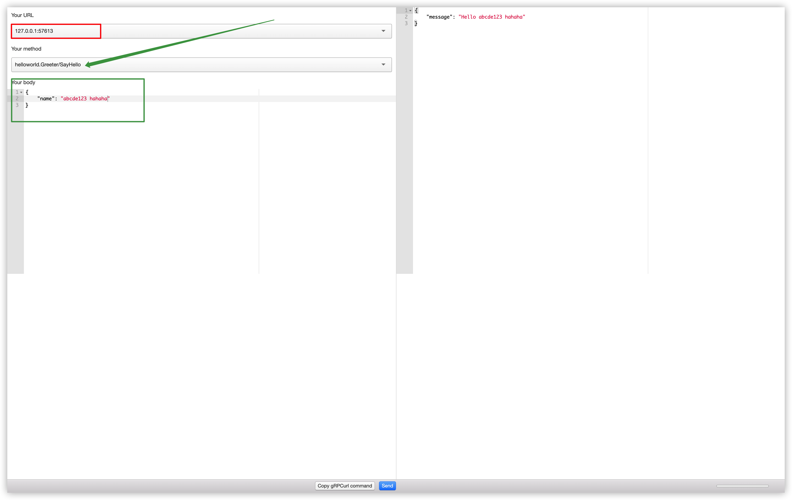
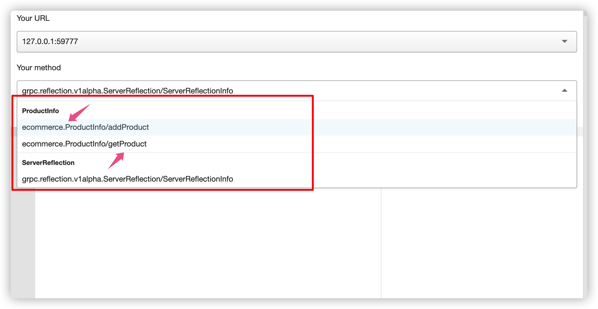
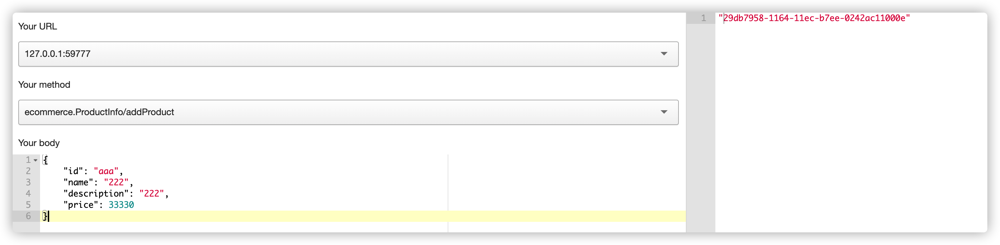
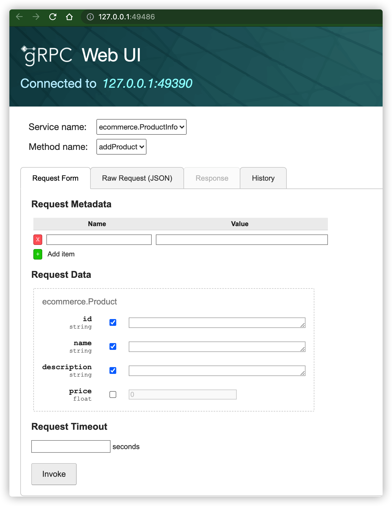

# gRPC


## 官网：
https://grpc.io/

## Reference:

http://colobu.com/2017/04/06/dive-into-gRPC-streaming/

https://yami.io/grpc/


#  调试工具

**grpcurl**   
***grpcurl ui - delivery***




```
grpcurl  -plaintext -max-time 5 -d '{"name": "abcde123 hahaha"}' 127.0.0.1:57613 helloworld.Greeter/SayHello

```








```
/Applications/delivery.app/Contents/Resources/bin/darwin/grpcurl -plaintext -max-time 5 -d '{
    "id": "aaa",
    "name": "222",
    "description": "222",
    "price": 33330
}' 127.0.0.1:59777 ecommerce.ProductInfo/addProduct
```


#  Ref

https://github.com/grpc-ecosystem/awesome-grpc


##  其它调试工具

https://github.com/fullstorydev/grpcui  [ webui ]
https://github.com/ktr0731/evans
https://github.com/uw-labs/bloomrpc


###  grpc wbeui
```
grpcui -plaintext 127.0.0.1:49390
```




